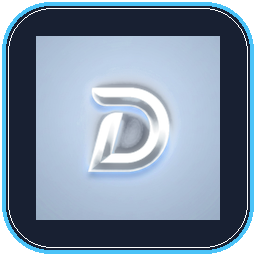

# DLives — Dynamic Island for Windows 10 & 11

<p align="center">
  
</p>

<p align="center">
  <strong>A sleek, hardware-accelerated Liquid Glass dynamic island & productivity dashboard for Windows.</strong>
</p>

<p align="center">
  <a href="LICENSE"></a>
  
  
  
</p>

---

## 🌟 Overview

**DLives** brings modern dynamic island interactions and glassmorphism productivity tools to Windows desktops. Living as an unobtrusive, always-on-top pill at the edge of your screen, DLives smoothly expands on hover into a full-featured productivity dashboard with media controls, hardware telemetry, calendar, alarms, quick notes, clipboard history, notifications, and custom app launching.

---

## ✨ Features

- 🎵 **Control Center & Media Hub**: Live track info, playback controls (SMTC-compatible with Spotify, Chrome, YouTube Music, etc.), system volume, and brightness sliders.
- 📊 **System Diagnostics**: Real-time CPU, RAM, battery status, network stats, storage info, and uptime monitoring.
- ⏰ **Alarms & Timetable**: Recurring daily schedules and custom alarms with audio chimes.
- 📅 **Calendar & Events**: Glassmorphic monthly calendar with persistent event tracking.
- 📋 **Clipboard & File Shelf**: Persistent clipboard history and drag-and-drop file staging area.
- 📝 **Scratchpad Notes**: Multi-note plain-text scratchpad with instant auto-save and home card pinning.
- 🚀 **App Launcher**: Quick-launch shortcuts for frequently used tools and programs.
- 🔔 **Windows Notifications**: Live notifications feed directly inside the island.
- 🎨 **Liquid Glass & Customization Studio**: Full live theme engine (Light/Dark, 10+ accent presets, custom hex, acrylic blur, opacity, corner radius, screen position).

---

## 🛠️ Requirements & Installation

### Requirements
- **OS**: Windows 10 (build 1903+) or Windows 11 (x64)
- No external runtime dependencies required for standalone binary releases.

### Running from Source
```bash
# Clone the repository
git clone https://github.com/rootnode-rebels/Dlives.git
cd Dlives

# Install dependencies
pip install -r requirements.txt

# Run application
python main.py
```

---

## 📄 License

This project is licensed under the **MIT License** — see the [LICENSE](LICENSE) file for details.

Copyright (c) 2026 Suhas Hoskere
